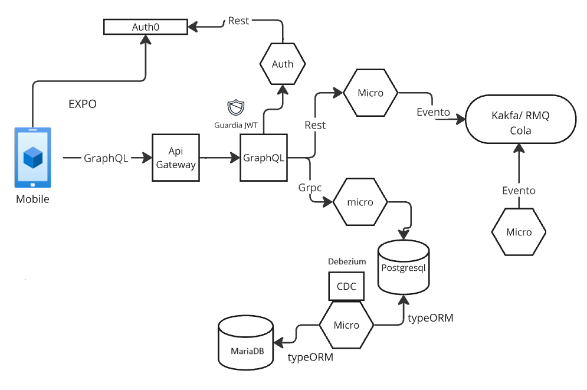

# proyectoFinal-g2


## Arquitectura de Integración
<p align="center">
    
</p>

## Workflow

#### Demostrar: 
Patrón de microservicios, mensajería (Kafka), orquestación GraphQL, un ejemplo de CDC (Postgres → Microservicio de Replica → MariaDB), autenticación con Auth0 y clientes (mobile con React Native) que consumen el Kong API Gateway.

### Ejecución
Para la ejecución del proyecto se debe situar en la raiz del proyecto y ejecutar el comando docker compose up -d.


## Sistema de Gestión de Cuentas y Consumos

### Descripción General
Sistema distribuido basado en microservicios para la gestión de cuentas bancarias y consumos, implementando una arquitectura moderna que incluye una App en React Native, GraphQL, gRPC, eventos asíncronos con Kafka, y autenticación con Auth0.


## Arquitectura

### Frontend
- **Mobile App**: Aplicación móvil que consume la API GraphQL pasando por Kong API Gateway

### API Gateway y GraphQL
- **Kong API Gateway**: 
  - Versión: 3.2
  - Puerto: 8000 (público)
  - Gestiona el tráfico entrante
  - Implementa CORS y seguridad básica

- **Servidor GraphQL**:
  - Apollo Server Express
  - Puerto: 4000
  - Unifica las APIs de los microservicios
  - Implementa resolvers para operaciones de cuentas y consumos

### Autenticación
- **Auth0**: Proveedor de identidad externo
- **Micro-Auth**:
  - Valida tokens JWT
  - Se integra con Auth0
  - Puerto: 3000
  - Proporciona capa de seguridad centralizada

### Microservicios

#### Servicio de Cuentas (ms-cuentas)
- Implementa gRPC para comunicación
- Puerto: 9090
- Gestiona operaciones CRUD de cuentas
- Utiliza PostgreSQL como base de datos

#### Servicio de Estado de Cuenta
- Puerto: 26061
- Genera estados de cuenta
- Publica eventos en Kafka

#### Servicio de Notificaciones
- Consume eventos de Kafka
- Podría usarse para enviar notificaciones usando por ejemplo Firebase

### Bases de Datos
- **PostgreSQL**:
  - Versión: 14-alpine
  - Puerto: 5432
  - Almacena datos principales de cuentas

- **MariaDB**:
  - Versión: 10.5
  - Puerto: 3305
  - Almacena datos replicados

### Mensajería y Eventos
- **Kafka**:
  - Gestión de eventos asíncronos
  - Puerto: 9092
  - Tópicos principales:
    - solicitar-estado-cuenta
    - cuentasdb.public.cuentas
    - cuentasdb.public.consumos

- **Zookeeper**:
  - Gestión de configuración de Kafka
  - Puerto: 2181

### CDC (Change Data Capture)
- **Debezium**:
  - Versión: 1.7
  - Puerto: 8083
  - Captura cambios en PostgreSQL
  - Replica datos a MariaDB

## Configuración y Despliegue

### Requisitos Previos
- Docker y Docker Compose
- Node.js (para desarrollo)
- Cuenta en Auth0

### Variables de Entorno Principales
```env
# Auth0
AUTH0_DOMAIN=dev-88x6n0ntfccbwhfp.us.auth0.com
AUTH0_AUDIENCE=https://dev-88x6n0ntfccbwhfp.us.auth0.com/api/v2/

# Bases de Datos
POSTGRES_DB=cuentasdb
POSTGRES_USER=postgres
POSTGRES_PASSWORD=postgres

# Kafka
KAFKA_BROKER=kafka:9092
```

### Despliegue
```bash
# Construir y levantar todos los servicios
docker-compose up -d

# Verificar servicios
docker-compose ps
```

## APIs y Endpoints

### GraphQL
```graphql
type Query {
  estadoDeCuenta(id: ID!): EstadoDeCuenta
  obtenerCuenta(id: ID!): Cuenta
  listarCuentas(id: ID!): Cuentas
  obtenerConsumo(id: ID!): Consumo
  listarConsumos(id: ID!): Consumos
}

type Mutation {
  crearCuenta(usuario_id: String, saldo_inicial: Float): Cuenta
  actualizarCuenta(id: ID!, saldo: Float, estado: String): Cuenta
  crearConsumo(cuenta_id: String, descripcion: String, monto: Float): Consumo
}
```

### Servicios REST
- Auth: `POST /validate`
- Estado de Cuenta: `GET /v1/estado-cuenta/{id}`

### gRPC
Servicios definidos en `cuenta.proto`:
- CrearCuenta
- ActualizarCuenta
- ObtenerCuenta
- ListarCuentas
- CrearConsumo
- ObtenerConsumo
- ListarConsumos

## Flujos Principales

### Creación de Cuenta
1. Cliente envía mutation GraphQL
2. GraphQL Server valida token con micro-auth
3. Llamada gRPC a ms-cuentas
4. Almacenamiento en PostgreSQL
5. Debezium captura cambio
6. Replicación a MariaDB

### Solicitud de Estado de Cuenta
1. Cliente envía query GraphQL
2. Validación de token
3. Llamada REST a micro-estado-cuenta
4. Publicación de evento en Kafka
5. Procesamiento por servicio de notificaciones

## Monitoreo y Logs
- Logs centralizados en stdout/stderr
- Accesibles via `docker logs`
- Cada servicio contenerizado mantiene sus propios logs

## Seguridad
- Autenticación JWT con Auth0
- CORS configurado en Kong API Gateway
- Comunicación segura entre servicios
- Credenciales gestionadas por variables de entorno

## Desarrollo Local
Cada servicio puede ejecutarse independientemente:
```bash
# API Gateway
docker-compose up kong

# GraphQL Server
docker-compose up graphql-server

# Servicios individuales
docker-compose up ms-cuentas
docker-compose up micro-auth
```

## Próximos Pasos y Mejoras
1. Implementar circuit breakers
2. Añadir métricas y monitoreo
3. Mejorar documentación de API
4. Implementar pruebas automatizadas
5. Configurar CI/CD
6. Añadir health checks
7. Implementar tracing distribuido

## Contribución
1. Fork del repositorio
2. Crear rama feature
3. Commit cambios
4. Push a la rama
5. Crear Pull Request

## Licencia
MIT

