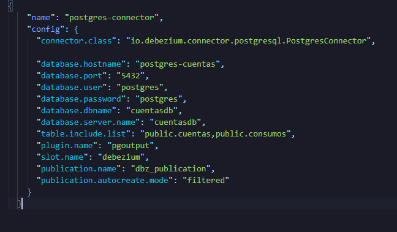
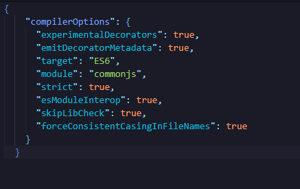
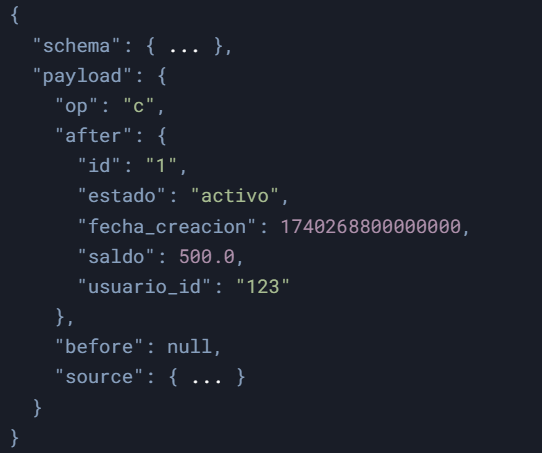

# Implementación de CDC con Debezium, Kafka y Node.js

### Este proyecto implementa un sistema de Change Data Capture (CDC) para capturar cambios en una base de datos PostgreSQL y replicarlos en una base de datos MySQL utilizando Debezium, Kafka y un consumer en Node.js.

# Requisitos

### -Docker y Docker Compose instalados.

### -Node.js (v16 o superior).

### -PostgreSQL (como base de datos fuente).

### -MySQL (como base de datos destino).

### -Kafka y Zookeeper (para el manejo de mensajes).

### -Debezium (conector de CDC para PostgreSQL).

# Flujo de Trabajo

## 1. Captura de Cambios:

### Debezium captura los cambios en PostgreSQL y los publica en un tópico de Kafka.

## 2. Procesamiento de Mensajes:

### El consumer en Node.js lee los mensajes de Kafka y replica los cambios en MySQL.

## 3. Replicación en MySQL:

### Los cambios se aplican en la base de datos MySQL en tiempo real.

# Configuración

## 1. Servicios Docker

### El archivo docker-compose.yml define los siguientes servicios:

### PostgreSQL: Base de datos fuente.

### Zookeeper: Coordinador de Kafka.

### Kafka: Broker de mensajes.

### Kafka Connect: Servicio para conectar Debezium.

### MySQL: Base de datos destino.

### Node.js Consumer: Aplicación que consume mensajes de Kafka y replica cambios en MySQL.

## 2. Conector Debezium

### El archivo debezium-connector/register-connector.json configura el conector Debezium para PostgreSQL:

 

     
 

## 3. Consumer en Node.js

### El consumer en Node.js utiliza TypeORM para replicar los cambios en MariaDB. La configuración de TypeORM se encuentra en Kafka-consumer/tsconfig.json:

 

     
 

# Ejecución

## 1. Levantar los Servicios

### Ejecuta el siguiente comando para levantar los servicios con Docker Compose:

## docker-compose up -d

## 2. Registrar el Conector Debezium

### Antes de registrar el conector tenemos q configurar el postgresql para que pueda hacer las replicas con los siguientes comandos:

## Configuración de PostgreSQL para replicación lógica

### Este conjunto de comandos configura PostgreSQL para permitir la replicación lógica, lo que facilita la captura de cambios en la base de datos.

## - `ALTER SYSTEM SET wal_level = 'logical';`

### Habilita la replicación lógica permitiendo la captura de cambios en las tablas.

## - `ALTER SYSTEM SET max_wal_senders = 10;`

### Define el número máximo de procesos que pueden enviar registros WAL a los suscriptores.

## - `ALTER SYSTEM SET max_replication_slots = 10;`

### Establece la cantidad máxima de slots de replicación para evitar la eliminación prematura de registros WAL.

## - `ALTER ROLE postgres WITH REPLICATION;`

### Otorga permisos de replicación al usuario `postgres`.

## - `GRANT ALL PRIVILEGES ON DATABASE cuentasdb TO postgres;`

### Concede todos los privilegios sobre la base de datos `cuentasdb` al usuario `postgres`.

## - `CREATE PUBLICATION dbz_publication FOR ALL TABLES;`

### Crea una publicación llamada `dbz_publication` para la replicación lógica de todas las tablas.

### Estas configuraciones son necesarias para herramientas como **Debezium**, que capturan cambios en la base de datos en tiempo realy despues de ejecutar todos esos comandos podemos hacer el registro del conector

## Registra el conector Debezium para PostgreSQL:

### este comando se utiliza para registrar el conector de la base de datos que se va a replicar

## curl -i -X POST -H "Accept:application/json" -H "Content-Type:application/json" http://localhost:8083/connectors/ -d @debezium-connector/register-connector.json

### Este comando se verifica si se registro el conector

## curl -H "Accept:application/json" localhost:8083/connectors/

### Este comando verifica el estado del conector

## curl -s http://localhost:8083/connectors/postgres-connector/status

## 3. Verificar la replicación

### Para la verificacion tenemos que realizar un INSERT,UPDATE,DELETE y se tiene q replicar en forma automatica a mariaDB

 

     
 

